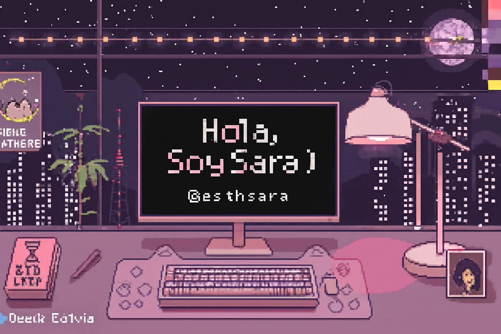

<!-- PORTADA -->

  

<h1 align="center">Bienvenido a mi repositorio :) </h1>

  

## 💜 Sobre mí

<table align="center">
  <tr>
    <td align="center" width="33%">
        
      <b>Diseño Web</b> 
      Interfaces limpias y bien estructuradas.
    </td>
    <td align="center" width="33%">
        
      <b>Bases de Datos</b> 
      Modelado y estructuras eficientes.
    </td>
    <td align="center" width="33%">
        
      <b>Aprendizaje Constante</b> 
      Siempre mejorando y adquiriendo nuevas habilidades.
    </td>
  </tr>
  <tr>
    <td align="center" width="33%">
        
      <b>Objetivo Profesional</b> 
      Crecer como desarrolladora Full Stack.
    </td>
    <td align="center" width="33%">
        
      <b>Desarrollo Backend</b> 
      APIs seguras y optimizadas.
    </td>
    <td align="center" width="33%">
        
      <b>Creatividad</b> 
      Diseño visual atractivo para proyectos.
    </td>
  </tr>
</table>
----
## 🎀 Tecnologías que uso

---

### 🎨 Frontend

---

### ⚙ Backend

---

### 🗄 Bases de Datos

---

### 🛠 Herramientas

---

## 🌷 Habilidades Blandas

✨ Pensamiento lógico  
✨ Perseverancia  
✨ Trabajo en equipo  
✨ Adaptabilidad  
✨ Mentalidad competitiva y enfocada  

## 📊 Estadísticas

  

  

---

## 🐍 Mis Contribuciones

  

---
## 🌸 Conecta conmigo

  
  
  

  

  

  💜 “Construyendo mi futuro línea por línea.” 💜

